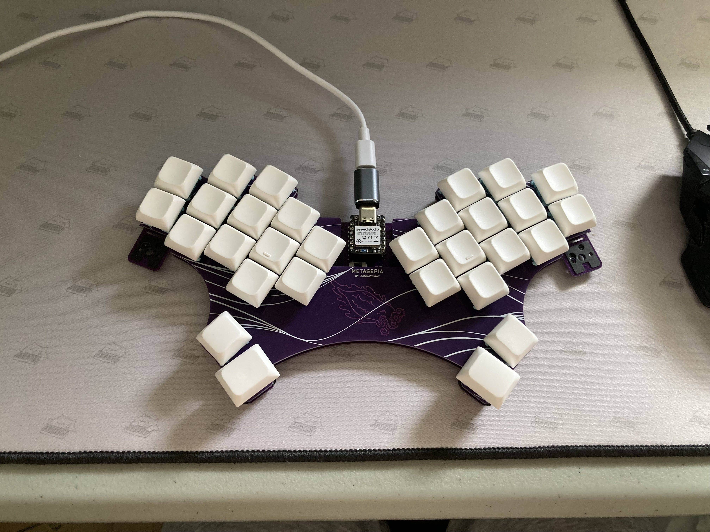
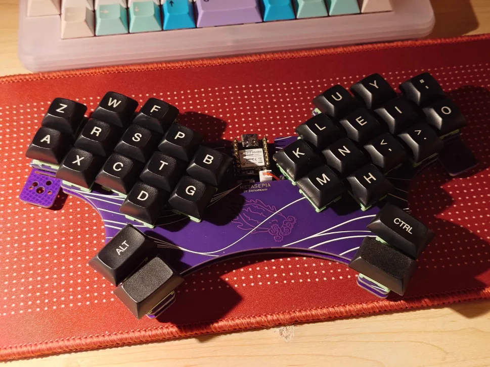
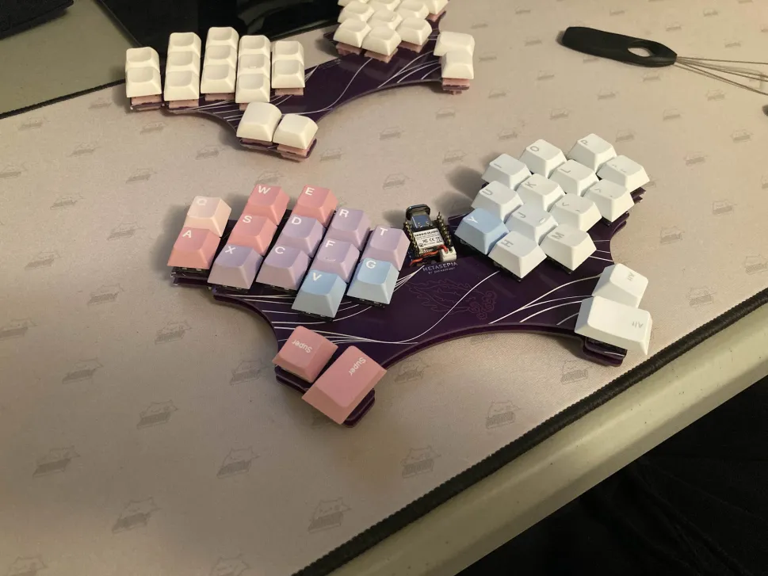
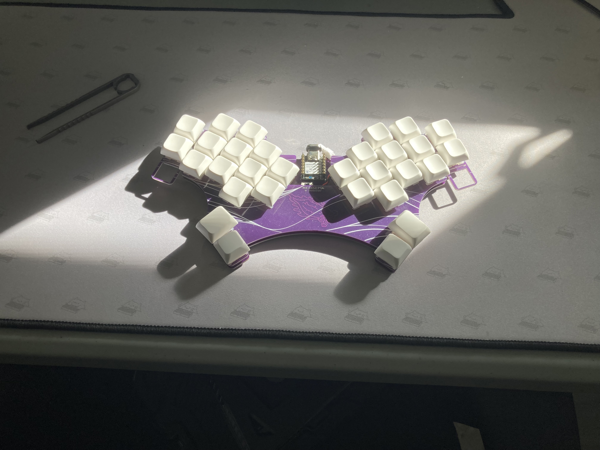

# metasepia
A hummingbird-esque keyboard, inspired by jcmkk3's rufous.
Notable changes:
  - more aggressive stagger (especially on index),
  - wireless compatibility,
  - hotswap for MX,
  - and a breakable bottom pinky key, bound to whatever the top pinky's bind is.

The pcb in the production directory is tested; fully functional with both xiao rp2040 & xiao nrf52840.

ZMK module can be found at [zmk-keyboard-metasepia](https://github.com/zakwaykway/zmk-keyboard-metasepia)

front | back
-|-
 | 

An intensive learning experience. 
Thanks to mrzealot for ergogen, ceoloide for their fork of ergogen, flatfootfox for their guide to ergogen; 
To the fingerpunch and 40% keyboard servers for questions and inspiration; 
To jcmkk3 for rufous' ergogen config; 
To ZMK for being the best keyboard firmware; 
To my friends for their art;
And to all who have open-sourced their keyboards, footprints, firmware configs, etc--all invaluable.

