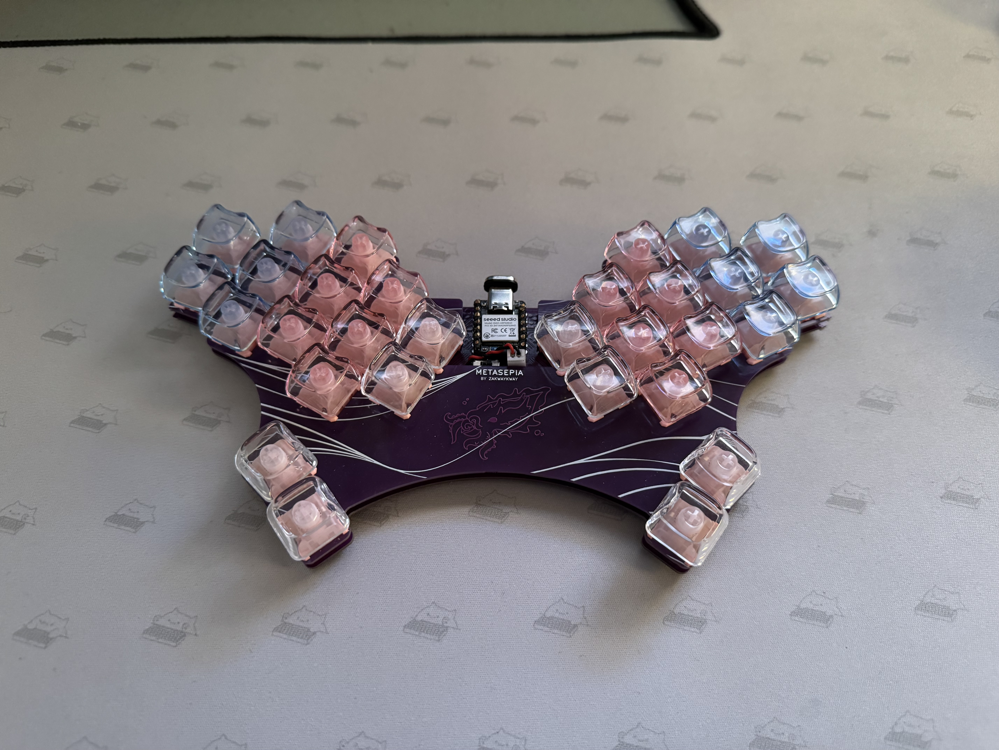
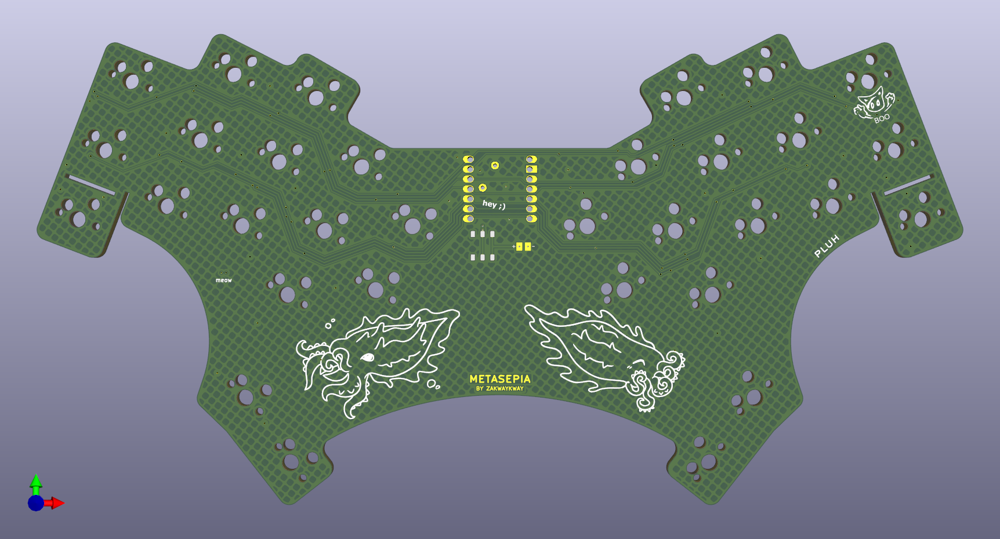
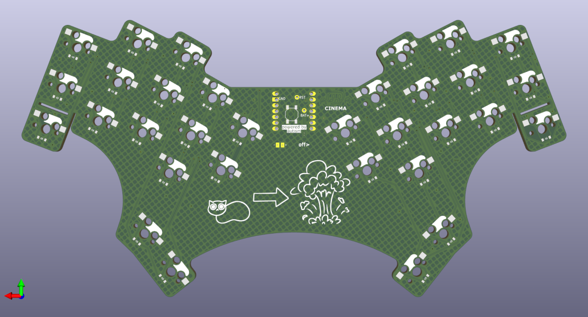
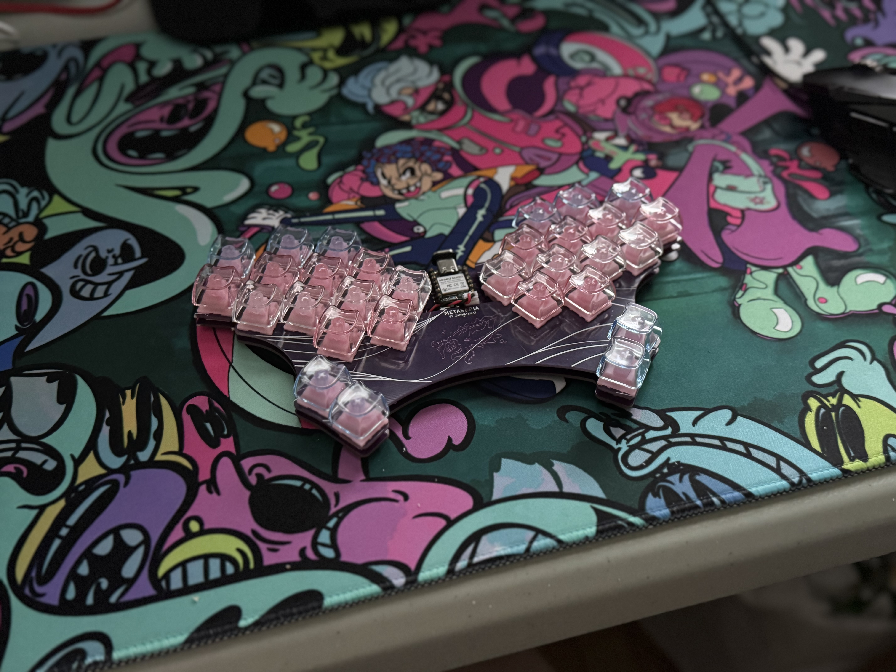

# Metasepia

An ergogenerated hummingbird-esque keyboard, inspired by jcmkk3's rufous, modified to my taste.

v2 is in development.

## Notable changes
  - Aggressive stagger (especially on index),
  - Wider thumbs,
  - Wireless compatibility,
  - Hotswappable,
  - And a breakable bottom pinky key (bound to top pinky's assignment in v1).

The pcb in v1/production is tested; fully functional with both xiao rp2040 & xiao nrf52840.

ZMK module (wired + wireless firmware) can be found at [zmk-keyboard-metasepia](https://github.com/zakwaykway/zmk-keyboard-metasepia).

front | back
-|-
 | 

## Assembly
### Components
- BOM.md
- If wireless isn't needed: BAT+ pogo, power slider, and battery aren't needed. Reset pogo & button are also optional, as there are other ways to trigger a reset.

### Build guide
0. **Optional:** remove bottom pinky key by cutting its traces, scoring the pcb at the tabs, and snapping off.
1. On **back** face: Tin **ONE** pad of each component.
2. Insert all hotswap sockets, and reflow tinned pads.
3. For diodes, I place and reflow one at a time, because they are a lot smaller & tend to jump around. 
4. Then, solder diodes' and sockets' 2nd (untinned) pads.
5. Solder reset button. 
6. On **front** face: solder slider switch, then MCU sockets.
7. Solder pogos. If male pins aren't soldered to the mcu yet, do that BEFORE adding pogos—doing it after is very tedious and annoying.
8. If careful, it IS POSSIBLE to solder a female JST-PH 2-pin connector. Its legs should be pointed **away** from the MCU (south). It is important that it be placed as close to the MCU as possible, or the plate won't fit over it.
9. **Enjoy your new keyboard!** Send me pics, suggestions, or comments @zakwaykway on discord \:))

## Thanks:
Making metasepia was an intensive learning experience, and a huge pride. 
Thanks to mrzealot for ergogen, ceoloide for their fork of ergogen, flatfootfox for their guide to ergogen; 
To the fingerpunch and 40% keyboard servers for questions and inspiration; 
To jcmkk3 for rufous' ergogen config; 
To ZMK for being an amazing keyboard firmware; 
To my friends, for making the art that's on the board;
And to all who have open-sourced their work, whether pcbs, footprints, or firmware--this wouldn't be possible without you.
